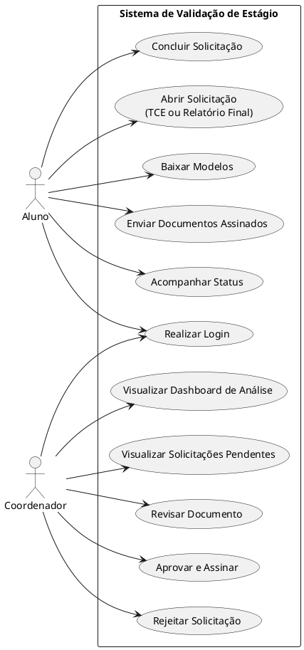

# Casos de Uso

## Introdução

Os casos de uso representam as principais interações entre os usuários e a plataforma de validação de documentos de estágio.
A partir dos requisitos elicidados, foram identificados dois atores principais: **Aluno** e **Coordenador**.

O aluno é responsável por abrir solicitações, gerar e enviar os documentos assinados e acompanhar o andamento do processo.
O coordenador atua na revisão dos documentos, na assinatura institucional (aprovação) ou rejeição, e no acompanhamento dos indicadores gerais dos estágios.

O diagrama a seguir apresenta a visão geral das funcionalidades do sistema.

---

## Diagrama de Casos de Uso

---

# Especificação dos Casos de Uso

## UC01 – Realizar Login

**Atores:** Aluno, Coordenador
**Objetivo:** Permitir acesso ao sistema via e-mail institucional.

**Pré-requisito:** O usuário deve possuir cadastro ativo com e-mail institucional válido.

**Fluxo principal:**

1. O usuário acessa a tela inicial.
2. Informa e-mail institucional e senha.
3. O sistema valida as credenciais.
4. O sistema redireciona para a interface correspondente ao perfil (aluno ou coordenador).

**Fluxo alternativo:**

- Caso as credenciais estejam inválidas, o sistema exibe mensagem de erro.

**Pós-requisito:** O usuário permanece autenticado e direcionado ao painel correspondente ao seu perfil.

---

## UC02 – Abrir Solicitação

**Ator:** Aluno
**Objetivo:** Iniciar um novo processo de estágio gerando o documento correspondente.

**Pré-requisito:** O aluno deve estar autenticado e não possuir outra solicitação em andamento.

**Fluxo principal:**

1. O aluno escolhe o tipo de solicitação: **TCE** (Termo de Compromisso de Estágio, acompanhado da apólice) ou **Relatório Final**.
2. O aluno preenche o formulário dinâmico do documento.
3. O aluno confirma; o sistema cria a solicitação, gera o documento em PDF e disponibiliza o download.

**Pós-requisito:** Uma nova solicitação é registrada com o documento gerado (status inicial **Gerado**), e o aluno baixa o PDF para assinatura.

---

## UC03 – Baixar Modelos

**Ator:** Aluno
**Objetivo:** Disponibilizar os modelos oficiais de documentos.

**Pré-requisito:** O aluno deve estar autenticado.

**Fluxo principal:**

1. O aluno acessa a opção de modelos.
2. Escolhe o documento desejado.
3. O sistema realiza o download.

**Pós-requisito:** O modelo oficial selecionado é salvo localmente pelo aluno.

---

## UC04 – Enviar Documentos Assinados

**Ator:** Aluno
**Objetivo:** Submeter os documentos já assinados para análise do coordenador.

**Pré-requisito:** O aluno deve ter gerado o documento e obtido as assinaturas do aluno e da empresa (de forma externa ao sistema).

**Fluxo principal:**

1. O aluno acessa a solicitação pelo card no painel.
2. Anexa os arquivos assinados em PDF (no caso do TCE, também a apólice de seguro).
3. O sistema armazena os arquivos e atualiza o status para **Enviado**.

**Pós-requisito:** Os documentos ficam disponíveis para revisão do coordenador.

---

## UC05 – Acompanhar Status

**Ator:** Aluno
**Objetivo:** Consultar o progresso da solicitação.

**Pré-requisito:** Deve existir ao menos uma solicitação registrada pelo aluno.

**Fluxo principal:**

1. O aluno acessa o painel.
2. O sistema exibe o status atual da solicitação:
   - Gerado
   - Enviado
   - Em assinatura (pela instituição)
   - Rejeitado
   - Aprovado
   - Concluída

**Pós-requisito:** O aluno obtém ciência do estado atual do processo.

---

## UC06 – Concluir Solicitação

**Ator:** Aluno
**Objetivo:** Encerrar o processo após a aprovação da instituição.

**Pré-requisito:** A solicitação deve estar **Aprovada** (documento assinado pela instituição).

**Fluxo principal:**

1. O aluno acessa o card da solicitação aprovada.
2. Visualiza a confirmação de sucesso e, se desejar, baixa o documento final assinado.
3. Confirma a conclusão.

**Pós-requisito:** A solicitação é marcada como **Concluída**, encerrando o fluxo.

---

## UC07 – Visualizar Solicitações Pendentes

**Ator:** Coordenador
**Objetivo:** Exibir as solicitações que aguardam análise.

**Pré-requisito:** O coordenador deve estar autenticado.

**Fluxo principal:**

1. O coordenador acessa o painel.
2. O sistema lista as solicitações cujos documentos foram enviados ou estão em assinatura.
3. O coordenador seleciona uma solicitação.

**Pós-requisito:** As solicitações ficam disponíveis para revisão.

---

## UC08 – Revisar Documento

**Ator:** Coordenador
**Objetivo:** Conferir o documento enviado pelo aluno.

**Pré-requisito:** A solicitação selecionada deve possuir documento enviado.

**Fluxo principal:**

1. O coordenador abre a solicitação.
2. O sistema exibe o PDF do documento em um visualizador integrado (no caso do TCE, o contrato e, em seguida, a apólice).

**Pós-requisito:** O coordenador possui informações suficientes para decidir.

---

## UC09 – Aprovar e Assinar

**Ator:** Coordenador
**Objetivo:** Formalizar a aprovação institucional.

**Pré-requisito:** O documento deve ter sido revisado.

**Fluxo principal:**

1. O coordenador baixa o documento para assinar (o status muda para **Em assinatura**).
2. Após assinar pela instituição (de forma externa), o coordenador envia o documento assinado.
3. O sistema atualiza o status para **Aprovado**.

**Pós-requisito:** A solicitação fica aprovada e o aluno é informado para concluir o processo.

---

## UC10 – Rejeitar Solicitação

**Ator:** Coordenador
**Objetivo:** Devolver a solicitação ao aluno quando houver problema (ex.: documento não assinado).

**Pré-requisito:** A solicitação deve estar em análise.

**Fluxo principal:**

1. Ao revisar, o coordenador opta por rejeitar.
2. Informa o motivo (a mensagem padrão "não assinado" pode ser editada).
3. O sistema atualiza o status para **Rejeitado** e registra o motivo.

**Pós-requisito:** O aluno visualiza o motivo e pode reenviar os documentos corrigidos.

---

## UC11 – Visualizar Dashboard de Análise

**Ator:** Coordenador
**Objetivo:** Acompanhar indicadores gerais dos estágios.

**Pré-requisito:** O coordenador deve estar autenticado.

**Fluxo principal:**

1. O coordenador acessa o dashboard de análise.
2. O sistema exibe contadores (solicitações, carga horária média, bolsa média, empresas parceiras) e gráficos (distribuição por status, bolsa por empresa e carga horária por curso), calculados a partir dos dados das solicitações.

**Pós-requisito:** O coordenador obtém uma visão geral consolidada dos estágios.

---

## Conclusão

Os casos de uso descritos consolidam a visão funcional da plataforma conforme o escopo implementado, servindo como base para a modelagem UML, prototipação e implementação.

---

## Autor(es)

| Data     | Versão | Descrição            | Autor(es)                                                                                              |
| -------- | ------ | -------------------- | ------------------------------------------------------------------------------------------------------ |
| 01/04/26 | 1.0    | Criação do documento | Bruno Norton, Christian Werneck, Gianluca Leonardi, Marcos Paulo Assunção, Maurício Gomes, Micael Dali |
| 11/06/26 | 1.1    | Atualização dos casos de uso para refletir o fluxo implementado (assinatura externa, conclusão pelo aluno e dashboard de análise; remoção de score por IA, assinatura digital interna e encaminhamento à reitoria) | Equipe |
