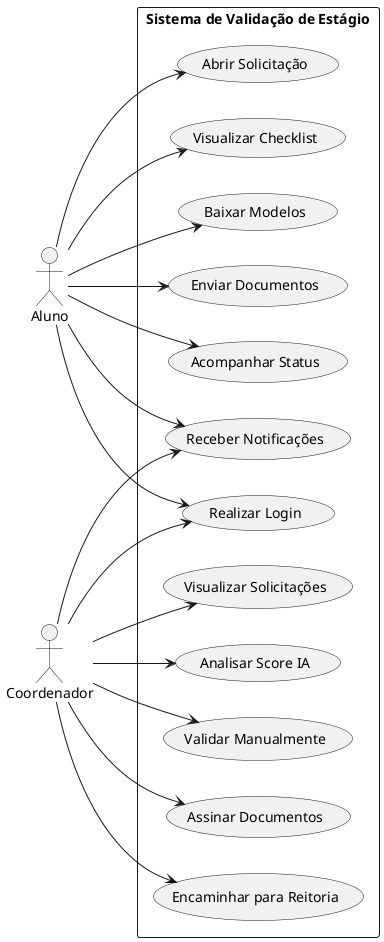

# Casos de Uso

## Introdução

Os casos de uso representam as principais interações entre os usuários e a plataforma de validação automática de documentos de estágio.  
A partir dos requisitos elicidados no brainstorm, foram identificados dois atores principais: **Aluno** e **Coordenador**.

O aluno é responsável por abrir solicitações, enviar documentos e acompanhar o andamento do processo.  
O coordenador atua na supervisão, validação manual complementar, assinatura e encaminhamento institucional.

O diagrama a seguir apresenta a visão geral das funcionalidades do sistema.

---

## Diagrama de Casos de Uso

---

# Especificação dos Casos de Uso

## UC01 – Realizar Login

**Atores:** Aluno, Coordenador  
**Objetivo:** Permitir acesso seguro ao sistema via e-mail institucional.

**Pré-requisito:** O usuário deve possuir cadastro ativo com e-mail institucional válido.

**Fluxo principal:**

1. O usuário acessa a tela inicial.
2. Informa e-mail institucional e senha.
3. O sistema valida as credenciais.
4. O sistema redireciona para a interface correspondente ao perfil.

**Fluxo alternativo:**

- Caso as credenciais estejam inválidas, o sistema exibe mensagem de erro.

**Pós-requisito:** O usuário permanece autenticado e direcionado ao painel correspondente ao seu perfil.

---

## UC02 – Abrir Solicitação

**Ator:** Aluno  
**Objetivo:** Iniciar um novo processo de validação de estágio.

**Pré-requisito:** O aluno deve estar autenticado no sistema.

**Fluxo principal:**

1. O aluno acessa a área de solicitações.
2. Seleciona curso e campus.
3. O sistema cria uma nova solicitação.
4. O checklist de documentos é exibido.

**Pós-requisito:** Uma nova solicitação é registrada no sistema com status inicial.

---

## UC03 – Visualizar Checklist

**Ator:** Aluno  
**Objetivo:** Exibir a lista de documentos obrigatórios do curso.

**Pré-requisito:** Deve existir uma solicitação aberta vinculada ao curso do aluno.

**Fluxo principal:**

1. O aluno seleciona a solicitação.
2. O sistema consulta as regras do curso.
3. O checklist é exibido.

**Pós-requisito:** O checklist obrigatório fica disponível para consulta e preenchimento.

---

## UC04 – Baixar Modelos

**Ator:** Aluno  
**Objetivo:** Disponibilizar templates oficiais.

**Pré-requisito:** O aluno deve possuir uma solicitação ativa.

**Fluxo principal:**

1. O aluno acessa a seção de modelos.
2. Escolhe o documento desejado.
3. O sistema realiza o download.

**Pós-requisito:** O modelo oficial selecionado é salvo localmente pelo aluno.

---

## UC05 – Enviar Documentos

**Ator:** Aluno  
**Objetivo:** Submeter os arquivos necessários para análise.

**Pré-requisito:** O aluno deve possuir todos os documentos exigidos no checklist.

**Fluxo principal:**

1. O aluno seleciona os arquivos.
2. O sistema faz upload.
3. A IA inicia a análise automática.
4. O status muda para **Em validação**.

**Pós-requisito:** Os documentos ficam armazenados e disponíveis para análise da IA e do coordenador.

---

## UC06 – Acompanhar Status

**Ator:** Aluno  
**Objetivo:** Consultar o progresso da solicitação.

**Pré-requisito:** Deve existir ao menos uma solicitação registrada pelo aluno.

**Fluxo principal:**

1. O aluno acessa suas solicitações.
2. O sistema exibe o status atual:
   - Em validação
   - Pendente de correção
   - Aprovado
   - Encaminhado à reitoria

**Pós-requisito:** O aluno obtém ciência do estado atual do processo.

---

## UC07 – Receber Notificações

**Atores:** Aluno, Coordenador  
**Objetivo:** Informar mudanças relevantes no fluxo.

**Pré-requisito:** O usuário deve estar vinculado a uma solicitação ou fluxo de validação.

**Eventos de notificação:**

- envio concluído
- validação IA finalizada
- solicitação aprovada
- solicitação devolvida
- encaminhamento à reitoria

**Pós-requisito:** O usuário é informado sobre a alteração de status ou evento ocorrido.

---

## UC08 – Visualizar Solicitações

**Ator:** Coordenador  
**Objetivo:** Exibir solicitações do curso sob sua responsabilidade.

**Pré-requisito:** O coordenador deve estar autenticado e vinculado a um curso.

**Fluxo principal:**

1. O coordenador acessa o painel.
2. O sistema lista solicitações por curso.
3. O coordenador seleciona uma solicitação.

**Pós-requisito:** As solicitações ficam disponíveis para inspeção e validação.

---

## UC09 – Analisar Score IA

**Ator:** Coordenador  
**Objetivo:** Consultar a análise automática realizada pela IA.

**Pré-requisito:** A IA deve ter concluído a análise dos documentos enviados.

**Fluxo principal:**

1. O coordenador abre a solicitação.
2. O sistema exibe:
   - score percentual
   - documentos aceitos
   - inconsistências encontradas
   - observações da IA

**Pós-requisito:** O coordenador possui informações suficientes para tomada de decisão.

---

## UC10 – Validar Manualmente

**Ator:** Coordenador  
**Objetivo:** Revisar e decidir sobre a aprovação final.

**Pré-requisito:** O score e os comentários da IA devem estar disponíveis.

**Fluxo principal:**

1. O coordenador revisa a análise.
2. Decide entre:
   - aprovar
   - reprovar
   - solicitar retificação

**Pós-requisito:** A solicitação recebe uma decisão formal do coordenador.

---

## UC11 – Assinar Documentos

**Ator:** Coordenador  
**Objetivo:** Formalizar a aprovação institucional.

**Pré-requisito:** A solicitação deve ter sido aprovada manualmente.

**Fluxo principal:**

1. O coordenador aprova a solicitação.
2. O sistema disponibiliza assinatura digital.
3. O documento é assinado.

**Pós-requisito:** O documento passa a conter assinatura válida do coordenador.

---

## UC12 – Encaminhar para Reitoria

**Ator:** Coordenador  
**Objetivo:** Encaminhar documentos aprovados para assinatura final.

**Pré-requisito:** O documento deve estar assinado pelo coordenador.

**Fluxo principal:**

1. Após assinatura do coordenador, o sistema envia à reitoria.
2. O status é atualizado.
3. O aluno recebe notificação.

**Pós-requisito:** A solicitação fica registrada como enviada para assinatura final da reitoria.

---

## Conclusão

Os casos de uso descritos consolidam a visão funcional inicial da plataforma, servindo como base para modelagem UML, prototipação e implementação.

---

## Autor(es)

| Data     | Versão | Descrição            | Autor(es)                                                                                              |
| -------- | ------ | -------------------- | ------------------------------------------------------------------------------------------------------ |
| 01/04/26 | 1.0    | Criação do documento | Bruno Norton, Christian Werneck, Gianluca Leonardi, Marcos Paulo Assunção, Maurício Gomes, Micael Dali |
