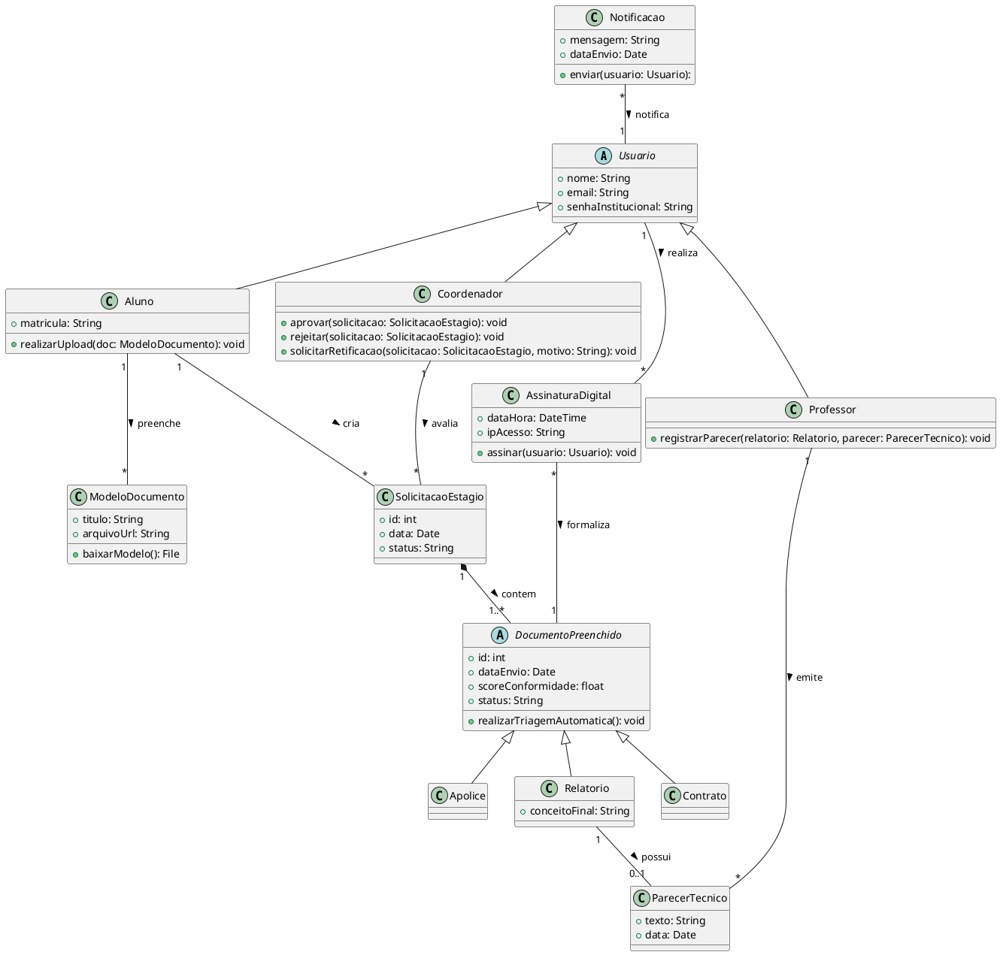

# Diagrama de Classes

## Introdução

O diagrama de classes é o diagrama UML mais usado principalmente por servir como uma ponte entre os requisitos do sistema e a implementanção em código, devido à sua estrutura similar à usada nas principais linguagens de programação com suporte a Orientação a Objeto, como Python e Java.

Além disso, o diagrama de classes funciona como uma representação visual geral de como o código do sistema vai ser implementado, como veremos no diagrama a seguir.

---

## Mapeamento das Classes do Sistema

---

## Conclusão

Com o Diagrama de Classes pronto, a implementação dos modelos elaborados para descrever o funcionamento do sistema em código será muito mais fluida e direta, mantendo a estrtura de Orientação a Objetos e apenas traduzindo os detalhes de implementação para cada linguagem de programação.

---

## Autor(es)

| Data     | Versão | Descrição            | Autor(es)                                                                                              |
| -------- | ------ | -------------------- | ------------------------------------------------------------------------------------------------------ |
| 01/04/26 | 1.0    | Criação do documento | Bruno Norton, Christian Werneck, Gianluca Leonardi, Marcos Paulo Assunção, Maurício Gomes, Micael Dali |
