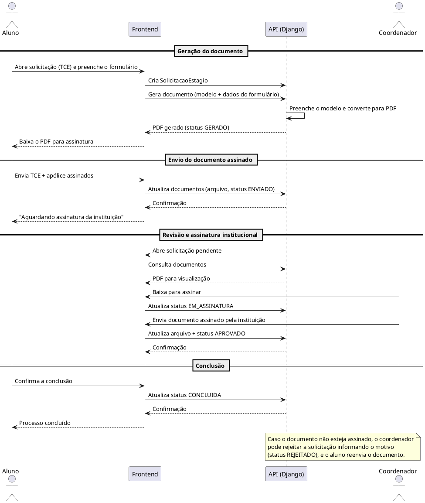

# Diagrama de Sequência

## Introdução

O diagrama de sequência descreve, ao longo do tempo, a troca de mensagens entre os atores e os componentes do sistema durante o fluxo principal de uma solicitação de estágio: a geração do documento pelo aluno, o envio do documento assinado, a revisão e assinatura pelo coordenador e a conclusão pelo aluno.

---

## Fluxo Principal — Solicitação de Estágio

---

## Conclusão

O diagrama de sequência evidencia a ordem das interações e a responsabilidade de cada participante no fluxo, servindo de apoio para a implementação e a validação do comportamento do sistema.

---

## Autor(es)

| Data     | Versão | Descrição            | Autor(es)                                                                                              |
| -------- | ------ | -------------------- | ------------------------------------------------------------------------------------------------------ |
| 11/06/26 | 1.0    | Substituição do conteúdo de exemplo pelo diagrama de sequência do fluxo de estágio implementado | Equipe |
