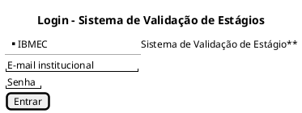
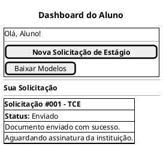
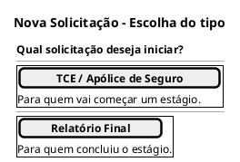
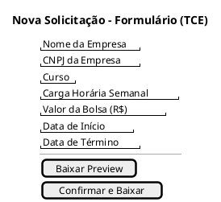
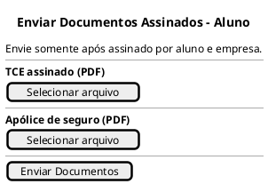
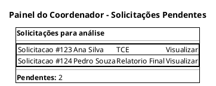
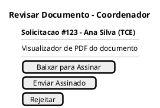
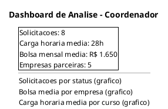

## Introdução

A construção do protótipo de baixa fidelidade auxilia a equipe de desenvolvimento a encontrar um nível inicial de detalhes, extrair funcionalidades, testar a usabilidade e fornecer uma base para o gerenciamento do projeto, permitindo estimar o esforço necessário em cada funcionalidade antes da implementação.

## Metodologia

A partir dos levantamentos iniciais da equipe, os wireframes de baixa fidelidade foram produzidos com a ferramenta PlantUML Salt, descrevendo as telas e o fluxo principal da aplicação. Esses esboços serviram de base para o protótipo de alta fidelidade e para a interface final.

## Protótipo de baixa fidelidade

Este protótipo descreve a experiência básica da aplicação "Sistema de Validação de Estágios" para os dois perfis identificados: aluno e coordenador. O foco está em validar o login, a abertura de solicitação (geração do documento), o envio dos documentos assinados, o acompanhamento de status, a revisão e assinatura pelo coordenador e a visão geral dos estágios.

### Telas necessárias

- **Login institucional**: acesso por e-mail @ibmec, com direcionamento automático ao painel do perfil (Aluno ou Coordenador).
- **Dashboard do Aluno**: card da solicitação ativa com seu status, além dos botões de nova solicitação e download de modelos.
- **Nova Solicitação**: escolha do tipo de documento (TCE/Apólice ou Relatório Final) e formulário dinâmico para gerar o PDF.
- **Envio de Documentos**: upload dos documentos já assinados (no TCE, contrato e apólice).
- **Painel do Coordenador**: lista de solicitações pendentes de análise.
- **Revisão do Documento**: visualizador de PDF com as ações de baixar para assinar, enviar assinado ou rejeitar (com motivo).
- **Dashboard de Análise**: indicadores e gráficos gerais sobre os estágios.

### PlantUML Salt - Login institucional

### PlantUML Salt - Dashboard do Aluno

### PlantUML Salt - Nova Solicitação (escolha do tipo)

### PlantUML Salt - Formulário de Nova Solicitação (TCE)

### PlantUML Salt - Envio de Documentos Assinados

### PlantUML Salt - Painel do Coordenador

### PlantUML Salt - Revisão do Documento

### PlantUML Salt - Dashboard de Análise

## Conclusão

A partir da elaboração do protótipo foi possível ter uma noção inicial da interface do usuário, definindo telas, fluxo e funcionalidades que orientaram a construção do sistema.

## Referências

> Ferramenta PlantUML para Criação de Protótipos. Disponível em https://plantuml.com/salt

## Autor(es)

| Data     | Versão | Descrição                            | Autor(es)                                                                           |
| -------- | ------ | ------------------------------------ | ----------------------------------------------------------------------------------- |
| 10/04/2026 | 1.0  | Criação de documento | Bruno Norton, Christian Werneck, Gianluca Leonardi, Marcos Paulo Assunção, Maurício Gomes e Micael Dali |
| 11/06/2026 | 1.1  | Atualização do protótipo para refletir o escopo implementado (remoção de score por IA, assinatura digital interna, parecer técnico e encaminhamento à reitoria) | Equipe |
